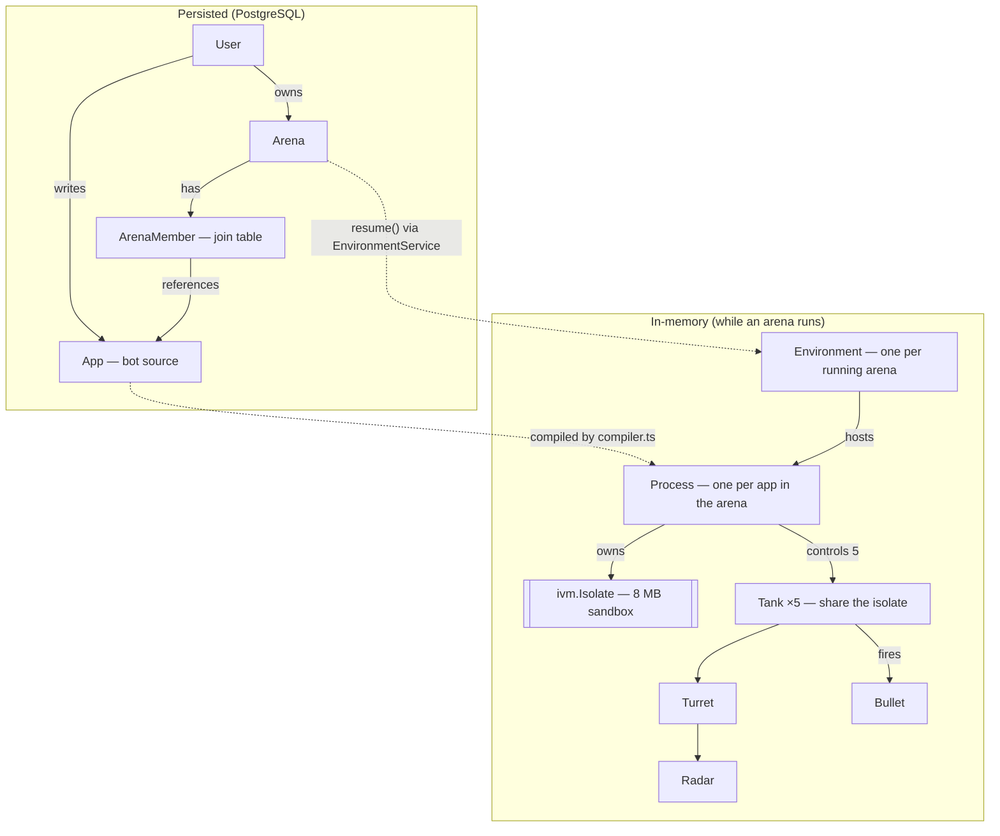

# RobocodeJs

**A browser-based programming game.** Write JavaScript "bots" — the AI for a team of tanks — and set them loose in a shared arena to find and destroy the competition. Brainstorm a strategy, program it, save, and watch your team immediately adapt and battle in real time. Onwards to fame and glory!

🌐 [robocodeJs.com](https://robocodeJs.com)

## How the game works

The arena is a square space where teams of tanks fight. Each **app** you write is the artificial intelligence shared by one team (five tanks). Every tank has a **radar** to detect enemies, a **turret** with a reloading cannon, and a drivetrain that accelerates and turns over time. Your goal: eliminate the other teams before they eliminate you.

You program against a `bot` object (plus `arena` and `clock`) and react to events — `START`, `TICK`, `SCANNED`, `HIT`, `COLLIDED`, and more. Because movement, firing, and scanning all take time, the time-based actions return Promises so you can wait for them. Edit your code and save, and every tank on your team picks up the new logic instantly.

```js
bot.setName('My First Bot');

// Get moving when the match starts.
bot.on(Event.START, () => {
  bot.setSpeed(10);
  bot.radar.setOrientation(0);
  bot.turret.setOrientation(0);
});

// Every clock tick: scan, and fire at any enemy we find.
clock.on(Event.TICK, async () => {
  const targets = await bot.radar.onReady().then(bot.radar.scan);
  if (targets.length > 0 && !targets[0].friendly) {
    return bot.turret.onReady().then(bot.turret.fire);
  }
});

// Bounced off a wall or another tank? Turn and keep going.
bot.on(Event.COLLIDED, () => bot.turn(40).then(() => bot.setSpeed(10)));
```

The full bot API is documented in [`ui/public/docs/`](ui/public/docs) (also served in-app at `/dev`), and there are worked examples in [`ui/public/samples/`](ui/public/samples).

## Architecture

RobocodeJs is a two-package monorepo plus a tiny root dev proxy:

- **`index.js`** — a root reverse proxy (port `5000`) that routes `/api` and `/health` to the server and everything else to the UI. This is the single port you open in development.
- **`server/`** (`@robocodejs/server`) — an Express + TypeScript API and the game simulation engine (port `8080`). See [`server/README.md`](server/README.md).
- **`ui/`** — a Vite + React + TypeScript front end (port `3000`) that renders the arena as SVG and hosts the bot code editor. See [`ui/README.md`](ui/README.md).

A few things worth knowing about how it fits together:

- **Untrusted code, safely sandboxed.** Every bot program runs in its own [`isolated-vm`](https://github.com/laverdet/isolated-vm) V8 isolate (one per app, shared by that team's five tanks). The bot-facing API (`bot`, `arena`, `clock`, `console`, timers, `Event`) is bridged into the isolate in `server/src/util/compiler.ts`. `Date` is deliberately removed so bots stay deterministic — they read time via `clock.getTime()`.
- **Tick-based simulation.** The engine (`server/src/util/simulation.ts`) advances the world one tick at a time — running bot event handlers, firing tick-driven timers, moving tanks, resolving collisions and bullet hits, and applying damage. The tick rate is adjustable (and can run unbounded for headless play), and with a fixed random seed a match replays identically.
- **AI-playable over MCP.** An in-process Model Context Protocol server (`POST /api/mcp`) lets an AI client (Claude, or any MCP client) write, run, and watch bots with the same tools a person uses — setup guide at `/mcp`.
- **Live streaming + client interpolation.** Arena state streams to the browser over Server-Sent Events; the UI applies those events and runs its own lightweight physics between ticks (`ui/src/util/simulate.ts`) for smooth motion.

### How the pieces relate

The same words name both a database row and a live object. The persisted entities (left) map onto the in-memory runtime (right) when an arena starts running:



In words: a **User** owns one or more **Arenas** and writes **Apps** (bot programs); an **ArenaMember** row records that an app has joined an arena. When an arena is running, `EnvironmentService` holds one **Environment** for it in memory; each member app becomes a **Process** that owns an 8 MB `isolated-vm` **Isolate** and controls a team of **5 Tanks** (which share that isolate). Each Tank has a **Turret** with a **Radar**, and fires **Bullets**.

## Getting started

### Prerequisites

- **Node.js ≥ 24** (required by the native `isolated-vm` build; a `.devcontainer` with Node 24 is included, and CI/deploy pin Node 24).
- That's it for local development — see below. **PostgreSQL** (`RDS_*` env vars) and **Google OAuth** are only needed for a production-like setup.

### Run it locally (zero-config)

From the repo root, install all three packages once, then start everything with a single command:

```bash
npm run install:all   # installs root + server + ui dependencies
npm start             # runs the proxy, server, and UI together (Ctrl-C stops all)
```

Then open <http://localhost:5000>. With no configuration, you land on a running arena with starter bots — **no database, no Google account, nothing to set up.**

`npm start` uses [concurrently](https://github.com/open-cli-tools/concurrently) to run the three processes with prefixed, color-coded output. Prefer separate terminals? Run them yourself:

```bash
node index.js              # root proxy on :5000  (open this one)
(cd server && npm run dev) # API + engine on :8080
(cd ui     && npm run dev) # Vite dev server on :3000
```

This works because the server picks one of two modes at startup based on a single signal — whether `RDS_HOSTNAME` is set:

|                | **Local-dev mode** (default)                                                                          | **Production-like mode**                                                   |
| -------------- | ----------------------------------------------------------------------------------------------------- | -------------------------------------------------------------------------- |
| **Trigger**    | `RDS_HOSTNAME` unset _and_ `NODE_ENV` ≠ `production`/`test`                                           | `RDS_HOSTNAME` set (or `NODE_ENV=production`)                              |
| **Database**   | In-memory [pg-mem](https://github.com/oguimbal/pg-mem) — created on boot, **resets on every restart** | Real PostgreSQL via the `RDS_*` variables                                  |
| **Auth**       | **Bypassed** — every request is a fixed "Local Dev" user; no sign-in, the Google button never appears | Real **Google OAuth** (`GOOGLE_CLIENT_ID`); sign in with the in-app button |
| **First load** | "Local Dev" user is auto-created with starter bots and a live arena                                   | A user/arena is created on first sign-in                                   |

The toggle is computed in `server/src/util/devMode.ts` (`isLocalDev`). **Local-dev mode is for your machine only:** it can never activate when `NODE_ENV=production` (re-checked at the auth-bypass site), and it's disabled under `NODE_ENV=test` so the test suite exercises the real code paths. A real deployment always sets both `NODE_ENV=production` and `RDS_HOSTNAME`, so it gets production-like mode.

#### Developing against a real database + Google sign-in

To run the production-like stack locally (e.g. to test persistence or the OAuth flow), set the database variables before `npm run dev` — their presence alone flips the server out of local-dev mode:

```bash
export RDS_HOSTNAME=localhost RDS_PORT=5432 \
       RDS_DB_NAME=robocode RDS_USERNAME=postgres RDS_PASSWORD=postgres
export GOOGLE_CLIENT_ID=<your-oauth-client-id>   # must match the id the UI signs in with
```

Tables are created lazily on first use, so an empty database is fine. See [`server/README.md`](server/README.md#environment-variables) for the full variable list and the auth details (the UI posts the Google credential to `POST /api/session`, which sets an HttpOnly cookie the server verifies).

### Build

```bash
npm run build   # from the root: builds the UI then the server

# …or each package directly:
(cd ui     && npm run build)  # type-checks, then builds into server/dist/public
(cd server && npm run build)  # tsc -> server/dist
```

The UI build outputs directly into `server/dist/public`, which the server serves as static files in production.

Other root scripts: `npm test` and `npm run lint` run the respective task across both packages; `npm run install:all` installs all three.

### Packaging a deployable zip

`npm run package` (from the **root**) produces the deployable artifact in one step:

```bash
npm run install:all   # once, if dependencies aren't installed
npm run package       # builds everything, then zips the server
```

It runs the full build (`npm run build` — UI into `server/dist/public`, server into `server/dist/src`) and then the server's packaging step, which bumps the patch version, refreshes `npm-shrinkwrap.json`, and writes `server/robocodejs-<version>.zip`.

The zip contains exactly what Elastic Beanstalk needs to run — `package.json`, the lockfile, the compiled server (`dist/src`), the built UI (`dist/public`), and `.ebextensions` — and **excludes** the TypeScript sources (`src/`), tests (`test/`), coverage, `node_modules` (reinstalled on deploy), and any prior zips. On the instance, EB runs `npm install` then `npm start` (`node ./dist/src/index.js`). This mirrors the AWS CodeBuild pipeline (`buildspec.yaml`) and is the supported way to build a deploy artifact by hand.

### Code style & the pre-commit hook

Formatting is governed by a single root [`.prettierrc.json`](.prettierrc.json) for the whole repo. A **Husky pre-commit hook** runs [`lint-staged`](https://github.com/lint-staged/lint-staged), which applies `prettier --write` to staged files (JS/TS/CSS/Markdown/JSON/YAML/HTML) so commits stay consistently formatted automatically. The hook is installed by the `prepare` script when you run `npm install` at the root (part of `npm run install:all`); no manual setup is needed. To format the whole repo on demand, run `npx prettier --write .` from the root.

## Documentation

- [`CONTRIBUTING.md`](CONTRIBUTING.md) — how to set up, run the checks, and open a pull request. Contributions are welcome!
- [`server/README.md`](server/README.md) — API endpoints, the sandbox/compiler, the simulation engine, the MCP server, security, data model, environment variables.
- [`ui/README.md`](ui/README.md) — app structure, arena rendering, the SSE event reducer, client-side interpolation, the code editor, theming.
- [`CLAUDE.md`](CLAUDE.md) — orientation for working in the codebase (commands, conventions, gotchas); includes the security posture and accepted risks (a full OWASP Top 10 audit was completed and all medium-and-above findings remediated).
- [`ui/public/docs/`](ui/public/docs) — the in-app bot author documentation (also served at `/dev`); MCP setup guide at [`ui/public/docs/mcp.md`](ui/public/docs/mcp.md).

## Deployment

The app deploys via AWS CodeBuild (`buildspec.yaml`) to Elastic Beanstalk (config in `server/.ebextensions`):

1. `ui` is built into `server/dist/public` and `server` is compiled to `server/dist`.
2. The server runs as the single artifact, serving both the API and the static UI from one process on port `8080`.

The production runtime needs the same configuration as local dev — the `RDS_*` Postgres variables and `GOOGLE_CLIENT_ID` — plus `NODE_ENV=production`, which sets the `Secure` flag on the session cookie. The native `isolated-vm` module is compiled on deploy, so the instance needs `gcc`/`gcc-c++` (installed via `server/.ebextensions/options.config`). To build a versioned deploy zip by hand, run **`npm run package`** from the root — see [Packaging a deployable zip](#packaging-a-deployable-zip).

## License

ISC
