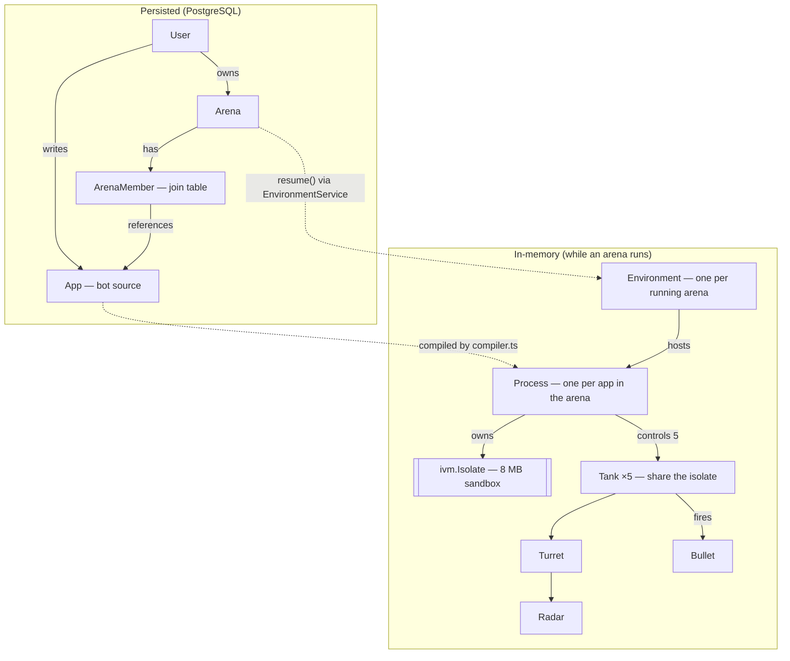

# RobocodeJs

**A browser-based programming game.** Write JavaScript "bots" — the AI for a team of tanks — and set them loose in a shared arena to find and destroy the competition. Brainstorm a strategy, program it, save, and watch your team immediately adapt and battle in real time. Onwards to fame and glory!

🌐 [robocodeJs.com](https://robocodeJs.com)

## How the game works

The arena is a square space where teams of tanks fight. Each **app** you write is the artificial intelligence shared by one team (five tanks). Every tank has a **radar** to detect enemies, a **turret** with a reloading cannon, and a drivetrain that accelerates and turns over time. Your goal: eliminate the other teams before they eliminate you.

You program against a `bot` object (plus `arena` and `clock`) and react to events — `START`, `TICK`, `SCANNED`, `HIT`, `COLLIDED`, and more. Because movement, firing, and scanning all take time, the time-based actions return Promises so you can wait for them. Edit your code and save, and every tank on your team picks up the new logic instantly.

```js
bot.setName('My First Bot')

// Get moving when the match starts.
bot.on(Event.START, () => {
  bot.setSpeed(10)
  bot.radar.setOrientation(0)
  bot.turret.setOrientation(0)
})

// Every clock tick: scan, and fire at any enemy we find.
clock.on(Event.TICK, async () => {
  const targets = await bot.radar.onReady().then(bot.radar.scan)
  if (targets.length > 0 && !targets[0].friendly) {
    return bot.turret.onReady().then(bot.turret.fire)
  }
})

// Bounced off a wall or another tank? Turn and keep going.
bot.on(Event.COLLIDED, () => bot.turn(40).then(() => bot.setSpeed(10)))
```

The full bot API is documented in [`ui/public/docs/`](ui/public/docs) (also served in-app at `/dev`), and there are worked examples in [`ui/public/samples/`](ui/public/samples).

## Architecture

RobocodeJs is a two-package monorepo plus a tiny root dev proxy:

- **`index.js`** — a root reverse proxy (port `5000`) that routes `/api` and `/health` to the server and everything else to the UI. This is the single port you open in development.
- **`server/`** (`@battletank/server`) — an Express + TypeScript API and the game simulation engine (port `8080`). See [`server/README.md`](server/README.md).
- **`ui/`** — a Vite + React + TypeScript front end (port `3000`) that renders the arena as SVG and hosts the bot code editor. See [`ui/README.md`](ui/README.md).

A few things worth knowing about how it fits together:

- **Untrusted code, safely sandboxed.** Every bot program runs in its own [`isolated-vm`](https://github.com/laverdet/isolated-vm) V8 isolate (one per app, shared by that team's five tanks). The bot-facing API (`bot`, `arena`, `clock`, `console`, timers, `Event`) is bridged into the isolate in `server/src/util/compiler.ts`. `Date` is deliberately removed so bots stay deterministic — they read time via `clock.getTime()`.
- **Tick-based simulation.** The engine (`server/src/util/simulation.ts`) advances the world on a fixed interval: it runs bot event handlers, fires tick-driven timers, moves tanks, resolves collisions and bullet hits, and applies damage.
- **Live streaming + client interpolation.** Arena state streams to the browser over Server-Sent Events; the UI applies those events and runs its own lightweight physics between ticks (`ui/src/util/simulate.ts`) for smooth motion.

### How the pieces relate

The same words name both a database row and a live object. The persisted entities (left) map onto the in-memory runtime (right) when an arena starts running:



In words: a **User** owns one or more **Arenas** and writes **Apps** (bot programs); an **ArenaMember** row records that an app has joined an arena. When an arena is running, `EnvironmentService` holds one **Environment** for it in memory; each member app becomes a **Process** that owns an 8 MB `isolated-vm` **Isolate** and controls a team of **5 Tanks** (which share that isolate). Each Tank has a **Turret** with a **Radar**, and fires **Bullets**.

## Getting started

### Prerequisites

- **Node.js ≥ 22** (required by the native `isolated-vm` build; a `.devcontainer` with Node 22 is included).
- **PostgreSQL**, configured via environment variables: `RDS_HOSTNAME`, `RDS_PORT`, `RDS_DB_NAME`, `RDS_USERNAME`, `RDS_PASSWORD`. Tables are created lazily on first use.
- Sign-in uses **Google OAuth**.

### Run it locally

There is no root-level install; work inside `server/` and `ui/` separately. Run all three processes (each in its own terminal):

```bash
node index.js                 # root proxy on :5000  (open this one)
(cd server && npm install && npm run dev)   # API + engine on :8080
(cd ui     && npm install && npm run dev)   # Vite dev server on :3000
```

Then open <http://localhost:5000>.

### Build

```bash
(cd ui     && npm run build)  # type-checks, then builds into server/dist/public
(cd server && npm run build)  # tsc -> server/dist
```

The UI build outputs directly into `server/dist/public`, which the server serves as static files in production.

## Documentation

- [`server/README.md`](server/README.md) — API endpoints, the sandbox/compiler, the simulation engine, data model, environment variables.
- [`ui/README.md`](ui/README.md) — app structure, arena rendering, the SSE event reducer, client-side interpolation, the code editor.
- [`CLAUDE.md`](CLAUDE.md) — orientation for working in the codebase (commands, conventions, gotchas).
- [`ui/public/docs/`](ui/public/docs) — the in-app bot author documentation.

## Deployment

The app deploys via AWS CodeBuild (`buildspec.yaml`) to Elastic Beanstalk (config in `server/.ebextensions`):

1. `ui` is built into `server/dist/public` and `server` is compiled to `server/dist`.
2. The server runs as the single artifact, serving both the API and the static UI from one process on port `8080`.

The production runtime needs the same configuration as local dev — the `RDS_*` Postgres variables and `GOOGLE_CLIENT_ID` — plus `NODE_ENV=production`, which sets the `Secure` flag on the session cookie. The native `isolated-vm` module is compiled on deploy, so the instance needs `gcc`/`gcc-c++` (installed via `server/.ebextensions/options.config`). To build a versioned deploy zip locally, run `cd server && npm run package`.

## License

ISC
